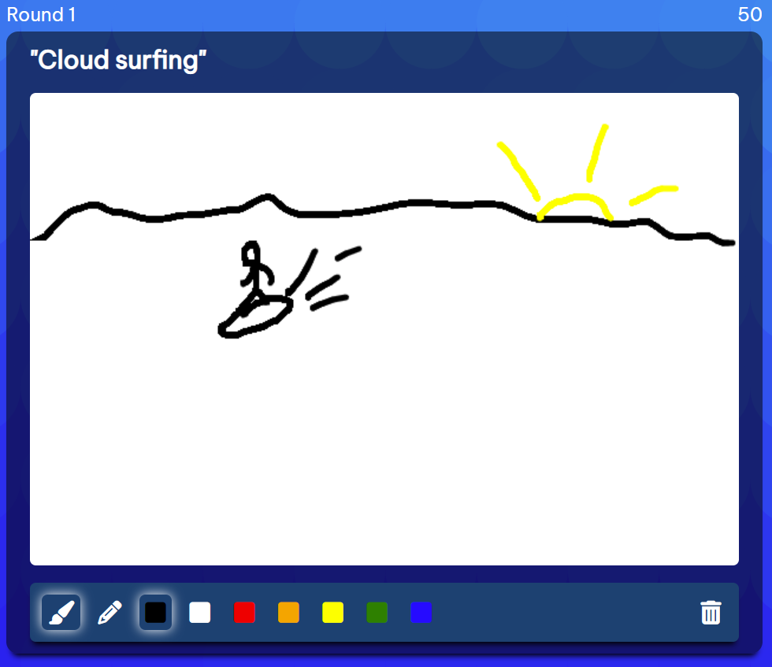

# Drawsome

## About the project

Drawsome is a a multiplayer drawing game inspired by pictionary and cards against humanity. A game consists of 1-5 rounds, where 3-8 players all draw a picture based on the same prompt displayed at the top of the drawing canvas. At the end of each round, players vote on their favorite drawing. A leaderboard shows the current standings in between rounds, then a final game results page is shown when the game is over. You can also draw solo, view all of your past solo and in-game drawings, edit drawing titles, and delete past drawings.

## [🔗 Live Site](https://drawsome-game.onrender.com/)

 

## Highlights

### **General** **layout**

### **Drawing**

### **Voting**

### **Leaderboard**

### **Game** **end**

## Upcoming features

- Improved drawing interface with more brush/color options and an undo button
- Ability to view all past game stats
- In game chat
- User profile pictures
- Sitewide leaderboard/statistics
- Friends/invite feature

## Tech Stack 🥞

